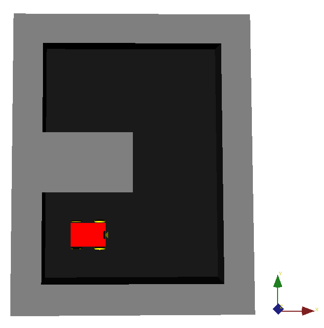

# map1

Coordinates in [map1.csv](map1.csv) coordinates, file indices starting at 1,1:
- Origin: Line 3, Column 3. ( 2.5 2.5 at resolution 1 )
- Destiny: Line 8, Column 3. ( 7.5 2.5 at resolution 1 )

